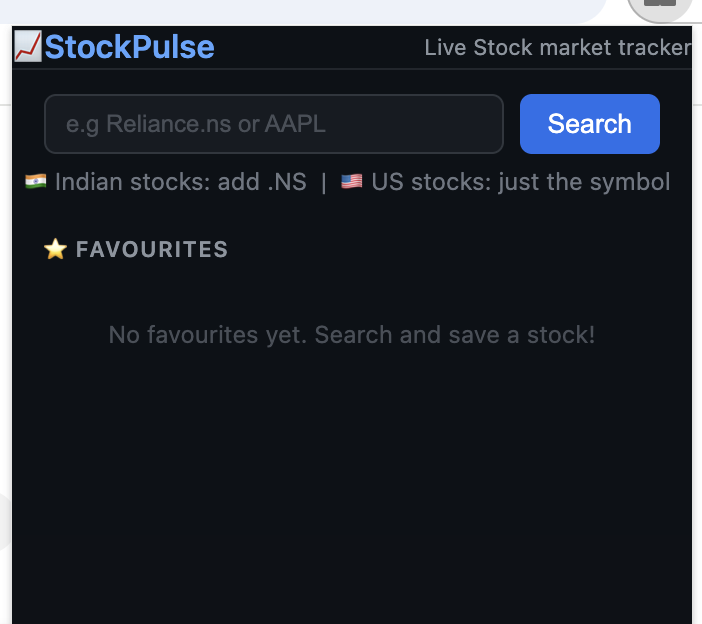
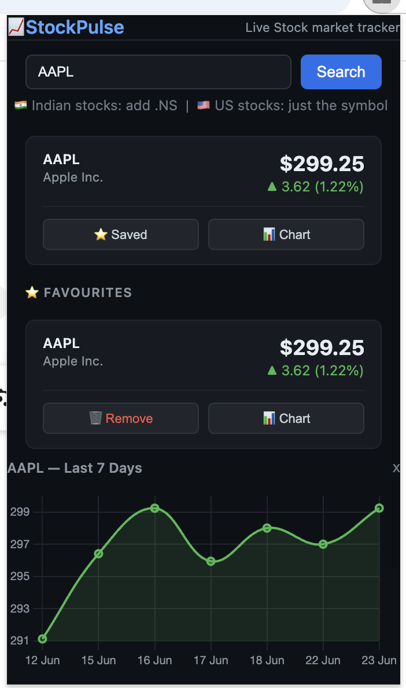

# 📈 StockPulse — Chrome Extension

> A lightweight Chrome extension to track real-time stock prices, save your favourite stocks, and visualize 1-week price history — right from your browser.


---

## 📸 Screenshots

### Home Screen


### Stock Price Result


## ✨ Features

- 🔍 **Search any stock** by ticker symbol (e.g. AAPL, TSLA, INFY)
- ⭐ **Save favourite stocks** and access them instantly with one click
- 📊 **7-day price history chart** powered by Chart.js
- 💹 **Live price updates** fetched from Yahoo Finance
- 🎨 **Clean, minimal UI** — works right inside your Chrome toolbar
- 🔔 Shows percentage change (▲ green / ▼ red) at a glance

---

## 🗂️ Project Structure

```
StockPulse/
├── manifest.json          # Chrome Extension config (Manifest V3)
├── popup.html             # Main UI shown when you click the extension
├── popup.js               # Logic: fetch prices, render chart, handle favourites
├── popup.css              # Styling for the popup UI
├── background.js          # Service worker (optional: background tasks)
├── icons/
│   ├── icon16.png
│   ├── icon48.png
│   └── icon128.png
├── screenshots/           # Screenshots used in this README
│   ├── home.png
│   ├── result.png
│   
├── .gitignore
├── LICENSE
└── README.md
```

---

## 🛠️ Tech Stack

| Technology | Purpose |
|---|---|
| HTML / CSS / JavaScript | Core extension UI and logic |
| Chrome Extension API (MV3) | Extension framework, storage |
| Yahoo Finance API | Real-time and historical stock data |
| Chart.js | 7-day price history graph |
| Chrome Storage API | Saving favourite stocks locally |

---


## 🚀 Installation (Local / Developer Mode)

> No store listing yet — install it manually in Chrome.

**Step 1 — Clone the repo**
```bash
git clone https://github.com/YOUR_USERNAME/StockPulse.git
cd StockPulse
```

**Step 2 — Open Chrome Extensions**
- Go to `chrome://extensions/` in your browser

**Step 3 — Enable Developer Mode**
- Toggle **Developer mode** on (top-right corner)

**Step 4 — Load the extension**
- Click **Load unpacked**
- Select the `StockPulse` project folder

**Step 5 — You're live! 🎉**
- Click the StockPulse icon in your Chrome toolbar
- Search for a stock ticker and start tracking

---

## 📡 Data Source

Stock prices are fetched using the **Yahoo Finance** unofficial API.

> ⚠️ Yahoo Finance does not provide an official public API. This extension uses a publicly accessible endpoint for personal/educational use. Do not use it for commercial purposes.

---

## 🔑 Permissions Used

Declared in `manifest.json`:

| Permission | Reason |
|---|---|
| `storage` | Save and retrieve favourite stocks |
| `alarms` | (Optional) Refresh prices periodically |
| `host_permissions` | Fetch data from Yahoo Finance endpoints |

---

## 📦 How to Build / Contribute

1. Fork this repository
2. Create a new branch: `git checkout -b feature/your-feature-name`
3. Make your changes
4. Commit: `git commit -m "Add: your feature description"`
5. Push: `git push origin feature/your-feature-name`
6. Open a Pull Request

Please read [CONTRIBUTING.md](CONTRIBUTING.md) before submitting.

---

## 🐛 Known Issues / Limitations

- Yahoo Finance endpoint may occasionally rate-limit requests
- Historical data beyond 7 days is not currently supported
- Extension is not yet published on the Chrome Web Store

---

## 🗺️ Roadmap

- [ ] Publish to Chrome Web Store
- [ ] Add price alerts / notifications
- [ ] Support for 1-month and 1-year chart views
- [ ] Dark mode toggle
- [ ] Portfolio value tracker

---

## 📄 License

This project is licensed under the **MIT License** — see the [LICENSE](LICENSE) file for details.

---

## 🙋 Author

Made with ❤️ by **[Priya Singh](https://github.com/billu-beep)**

---

> ⭐ If you find this useful, give it a star on GitHub!